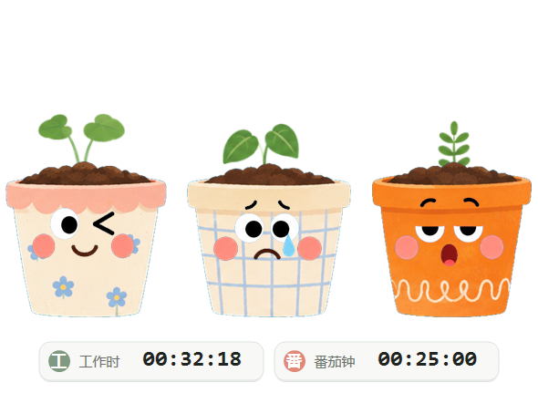
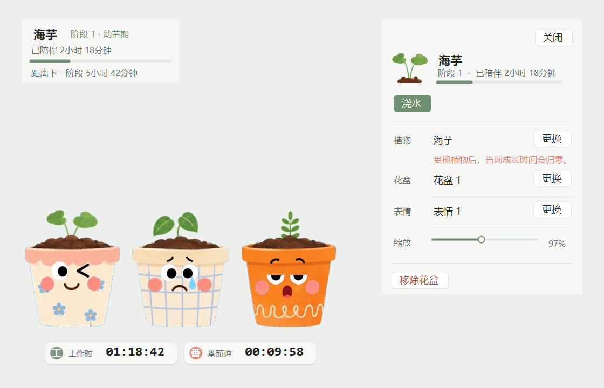

# Lovely Plants

中文：`Lovely Plants` 是一个轻量级的 Windows 桌面植物应用，你可以把一排花盆放在桌面底部，挑选植物、花盆和表情，并在软件运行过程中陪它们慢慢成长。  
English: `Lovely Plants` is a lightweight Windows desktop plant app that lets you place a row of pots along the bottom of your desktop, choose plants, pots, and expressions, and let them grow while the app is running.

中文：项目当前重点是“低打扰、低占用、可长期挂着”，因此首版采用 .NET 8 WinForms 单进程透明窗口方案，而不是 Electron 或 WebView。  
English: The current project focus is “low distraction, low overhead, and long-running stability,” so the first release uses a .NET 8 WinForms single-process transparent window instead of Electron or WebView.

## Who Is This For? / 这个项目适合谁？

中文：如果你是普通用户，只需要下载打包好的安装程序并双击安装，不需要关心源码、测试或打包脚本。  
English: If you are an end user, you only need the packaged installer and can install it by double-clicking it; you do not need to care about the source code, tests, or packaging scripts.

中文：如果你是素材作者或合作伙伴，可以重点查看 `src/DesktopGarden/Assets` 中实际被软件使用的素材，以及 `README` 中的界面说明和预览图。  
English: If you are the asset creator or a collaborator, you will mainly care about the production assets under `src/DesktopGarden/Assets` and the interface notes and preview images in this `README`.

中文：如果你是开发者，需要使用完整仓库，包括 `src`、`tests`、`installer`、`DesktopGarden.sln` 和文档目录，才能继续开发、测试和重新打包。  
English: If you are a developer, you need the full repository—including `src`, `tests`, `installer`, `DesktopGarden.sln`, and the docs directory—to continue development, testing, and repackaging.

## Preview / 预览


中文：启动动画会以这张背景图为底图，并在中央显示放大的 `Lovely Plants` 标题，在右下角显示作者署名。  
English: The startup animation uses this background as its base image, shows an enlarged `Lovely Plants` title in the center, and places the author credit in the lower-right corner.



中文：主界面会把花盆栏固定在桌面底部，底部附带独立的工作时间与番茄钟信息条。  
English: The main view anchors the garden row at the bottom of the desktop and includes a separate footer strip for work time and pomodoro timing.



中文：悬浮信息卡和右键检查面板会显示植物阶段、成长进度、素材切换和单盆缩放等信息。  
English: The hover info card and right-click inspector panel show plant stage, growth progress, asset switching, and per-pot scaling controls.

## Features / 功能

### Desktop Garden / 桌面花园

中文：花园以透明无边框窗口运行，默认吸附在所选显示器工作区底部，并支持始终置顶、显示器切换与整排偏移。  
English: The garden runs as a transparent borderless window, snaps to the bottom of the selected monitor work area by default, and supports always-on-top, monitor switching, and full-row offset.

中文：每个槽位由植物、花盆和表情三层素材合成，植物会轻微摇摆，表情会进行更轻的循环浮动。  
English: Each slot is composited from three visual layers—plant, pot, and expression—with a gentle plant sway and a lighter looping expression bob.

### Plant Growth / 植物成长

中文：植物成长只统计软件实际运行时间，累计 8 小时进入第二阶段，累计 40 小时进入第三阶段；关闭软件后不会离线成长。  
English: Plant growth only counts real app runtime: stage two starts after 8 accumulated hours and stage three starts after 40 accumulated hours; plants do not grow while the app is closed.

中文：更换植物会清空该花盆的成长时间，但花盆、表情和缩放设置可以继续保留。  
English: Changing the plant resets growth time for that pot, while the selected pot, expression, and scale can remain unchanged.

### Interaction / 交互

中文：左键长按花盆可以调整花盆左右顺序，右键长按可以拖动整排花盆在桌面上的位置。  
English: Left-click and hold a pot to reorder pots horizontally, and right-click and hold to move the entire garden row on the desktop.

中文：鼠标悬浮在花盆上方时，会显示植物名称、阶段、陪伴时长和阶段进度。  
English: Hovering a pot shows the plant name, stage, companionship time, and current stage progress.

中文：右键单击花盆会打开检查面板，可进行浇水、更换植物、更换花盆、更换表情和单盆缩放等操作。  
English: Right-clicking a pot opens the inspector panel, where you can water the plant, change the plant, switch the pot, switch the expression, and adjust per-pot scale.

### Work Companion Tools / 工作陪伴工具

中文：底部时间栏包含工作时间和番茄钟两部分，工作时间会在软件启动后持续计时，关闭软件后重置。  
English: The footer timing bar includes work time and a pomodoro timer; work time starts counting when the app launches and resets after the app closes.

中文：番茄钟支持手动设置倒计时，结束后数字会高亮为红色，并在花盆上方弹出提示。  
English: The pomodoro timer supports manual countdown setup; when it finishes, the digits turn red and a reminder appears above the garden.

中文：软件还会周期性弹出温馨提示语，用于提醒休息、喝水或短暂活动。  
English: The app also displays periodic gentle reminder messages for breaks, water, or short movement prompts.

### Settings / 设置

中文：设置面板支持显示器选择、整体缩放、花盆间距、始终置顶、锁定后鼠标穿透、交互/提醒音效和开机自动启动。  
English: The settings panel supports monitor selection, overall scale, pot spacing, always-on-top, mouse passthrough when locked, interaction/reminder sound effects, and launch at startup.

中文：整体缩放和花盆间距的滑条支持实时预览，拖动时可以立刻观察桌面花园的变化，取消则回退，保存则保留。  
English: The overall scale and pot spacing sliders support live preview, so the garden updates immediately while dragging; Cancel reverts the change, while Save keeps it.

## Usage Notes / 使用说明

中文：双击系统托盘图标或按 `Ctrl + Alt + G` 可以显示或隐藏花园。  
English: Double-click the tray icon or press `Ctrl + Alt + G` to show or hide the garden.

中文：右键托盘菜单可用于添加花盆、调整间距、打开植物图鉴、进入设置或退出程序。  
English: The tray menu can be used to add pots, adjust spacing, open the plant catalog, open settings, or exit the app.

中文：新增花盆后不会自动附带植物，必须手动选择植物后才开始成长。  
English: Newly added pots do not start with a plant automatically; growth begins only after a plant is selected manually.

## Data Storage / 数据存储

中文：用户状态保存在 `%LocalAppData%\LovelyPlants\state.json`，其中包含花盆顺序、植物类型、表情、缩放和累计成长时间。  
English: User state is stored in `%LocalAppData%\LovelyPlants\state.json`, including pot order, plant selection, expression, scale, and accumulated growth time.

中文：程序会定时保存并在正常退出时保存一次；如果状态文件损坏，会自动保留损坏备份并恢复默认状态。  
English: The app saves periodically and once again during normal exit; if the state file is corrupted, the app keeps a backup of the broken file and restores a default state.

## Packaging / 打包说明

中文：项目使用 .NET 8 自包含发布，并通过 Inno Setup 生成标准 Windows 安装包。  
English: The project is published as a .NET 8 self-contained build and packaged into a standard Windows installer through Inno Setup.

中文：当前本地生成的安装包文件名为 `artifacts/LovelyPlants-Setup-1.1.0.exe`。  
English: The current locally generated installer is named `artifacts/LovelyPlants-Setup-1.1.0.exe`.

## Build / 构建

中文：开发与打包需要 .NET 8 SDK，以及 Inno Setup 6。  
English: Development and packaging require the .NET 8 SDK and Inno Setup 6.

```powershell
& "C:\Program Files\dotnet\dotnet.exe" test DesktopGarden.sln -c Release
& "C:\Program Files\dotnet\dotnet.exe" publish .\src\DesktopGarden\DesktopGarden.csproj -c Release -r win-x64 --self-contained true -o .\artifacts\publish
& "$env:LOCALAPPDATA\Programs\Inno Setup 6\ISCC.exe" .\installer\DesktopGarden.iss
```

中文：发布目录位于 `artifacts/publish`，安装包输出位于 `artifacts/`。  
English: The publish directory is `artifacts/publish`, and the generated installer is written to `artifacts/`.

## Project Structure / 项目结构

- 中文：`src/DesktopGarden.Core` 负责成长规则、布局计算、数据模型和 JSON 持久化。  
  English: `src/DesktopGarden.Core` contains growth rules, layout calculation, data models, and JSON persistence.
- 中文：`src/DesktopGarden` 负责桌面窗口、绘制、交互、托盘菜单和设置界面。  
  English: `src/DesktopGarden` contains the desktop window, rendering, interaction, tray menu, and settings UI.
- 中文：`tests/DesktopGarden.Tests` 提供成长、布局和状态恢复相关测试。  
  English: `tests/DesktopGarden.Tests` provides tests for growth logic, layout rules, and state recovery.
- 中文：`installer/DesktopGarden.iss` 是当前安装包脚本。  
  English: `installer/DesktopGarden.iss` is the current installer script.

## Current Limitations / 当前限制

中文：目前仅支持 Windows 桌面环境，未提供 macOS、Linux 或移动端版本。  
English: The app currently supports Windows desktop only and does not provide macOS, Linux, or mobile versions.

中文：植物不会死亡，也没有缺水惩罚、联网同步、账号系统、云存档、商店和自动更新。  
English: Plants do not die, and there is currently no dehydration penalty, online sync, account system, cloud save, in-app store, or auto-update pipeline.

中文：成长时间完全依赖软件运行时长，因此如果程序没有启动，植物阶段也不会推进。  
English: Growth time depends entirely on app runtime, so plant stages do not progress while the app is not running.
